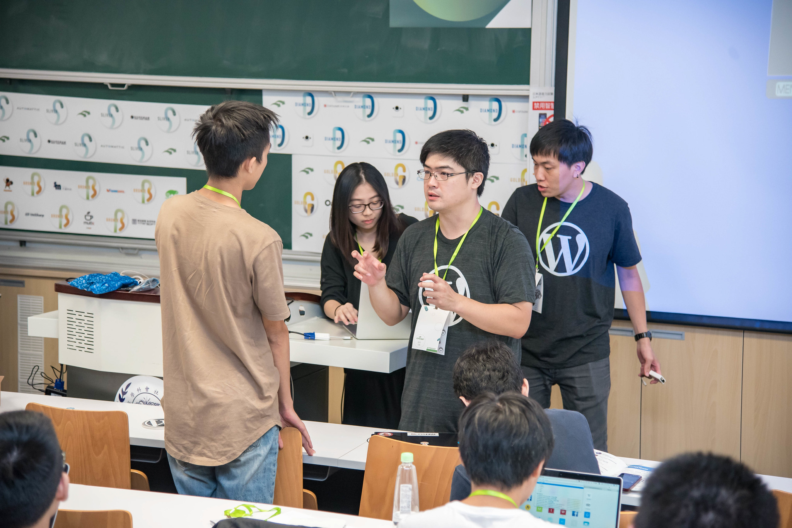

<h1>HELLO</h1>
my name is
<h2>Bob Chao</h2>

Note:

* 柏強

---

### Background ("context")

* Mozillian since 2002<!-- .element: class="fragment" -->
    * coordinating<!-- .element: class="fragment" -->
    * l10n, evangelist<!-- .element: class="fragment" -->
* Management, Marketing<!-- .element: class="fragment" -->
* Join COSCUP since 2007<!-- .element: class="fragment" -->

Note:

* 為了幫助大家了解我為什麼會這麼想，提供我的背景
* 接觸開源 Mozilla，因為是 Web Developer
* 主力是協調社群。讓社群成員做得到、做得爽、長期貢獻，這也是我一直到現在最關心的事
* 做 l10n 跟技術佈道，一直到兩三年前才有針對 WebVR 給 code contribution
* 資管系（"信息管理學系"）畢業，還是把自己看作管理學院出身
* 2007 年開始以講者身份參與 COSCUP，而後涉入組織行政
* 本名走跳，Google 或百度肉搜可得

---

TOPIC:

## "COSCUP & Community"

Note:

這節是 COSCUP 軌的尾聲，留這段希望介紹 COSCUP 跟台灣開源社群發展

---

# GOAL?

was "Shut up and book your flight!"<!-- .element: class="fragment" --> 
. 
.

Note:

想了解一下大家來這堂的目的是什麼？ (你為什麼不去隔壁間呢？)

我原本的目的是希望拉大家明年八月去 COSCUP，
不過來的這幾天跟這邊的許多人聊了天，
尤其昨天上午我們有一小群人在攤位這邊自己東拉西扯地聊了很多，
內容比較專注在社群的營運發展與開放源碼、商業等等的關係，
所以我想了想就改了內容。

當然還是會介紹 COSCUP 所以真的只是來了解一下的也別擔心，
但更多可能會放在「我們為什麼這麼設計 COSCUP」，以便跟參與社群營運的夥伴交流心得

---

# GOAL?

<strike>was "Shut up and book your flight!"</strike> 
Explain ideas behind 
<small class="fragment">(and, please book your flight.)</small>

Note:

希望大家可以就這些設計交流交流，討論辦這些活動之於社群的意義，
最好是聽了高興明年就來 COSCUP :P 也歡迎隨時舉手送 patch

---

# COSCUP？

Conference for Open Source<!-- .element: class="fragment" -->
Coders, Users, and Promoters

---

# Coders

(obviously...)

---

# Users

End Users &amp; Power Users<!-- .element: class="fragment" -->

Note:

在商場上定義 User 是很重要的問題，有時開發者也是種「User」。 
COSCUP 標題上的 User 一開始其實主要是「用 library/framework... 的人 + 使用軟體的人」，
不至於狹隘地定義在「終端用戶」

---

# Promoters

write how-tos, packaging, teaching, host events... etc.<!-- .element: class="fragment" -->

Note:

Promoter 範圍比較廣

---

# COSCUP

Note:

最大 COSplay 比賽

「餘弦杯」

---

# Facts

* Since 2006 <!-- .element: class="fragment" -->
* wide range of topics, 30% session from overseas <!-- .element: class="fragment" -->
* 1800+ attendees <!-- .element: class="fragment" -->
* 14 tracks * 2 days<!-- .element: class="fragment" -->
* with children care / hackroom <!-- .element: class="fragment" -->

---

### by the community, 
### for the community

Note:

COSCUP 的創始人當初以一句話定調：COSCUP 就是社群大拜拜 （不知道這邊對大拜拜這個詞是不是一樣用法）

這奠定了 COSCUP 最關心的就是社群，單看這個角度我們也還挺 Apache way 的 ;)

---

# Change log
#### and ideas behind

Note:

我就流水帳似地逐年把 COSCUP 的大項更動提出，藉此聊聊各種有無的理由與設計理念。
也許還有很多更動我沒有觀察到，但我盡可能把大項目都搜刮了

---

<!-- .slide: class="shortlist" -->

## 2006

* Fork from the community track of ICOS <!-- .element: class="fragment" -->
* Single day, 2 tracks <!-- .element: class="fragment" -->
* Staff: 7 ppl <!-- .element: class="fragment" -->

---

I wasn't there
### ¯\\\_(ツ)_/¯

Note:

我沒參與所以無法多說什麼，聽說很歡樂，形式上另一特色是充滿各種惡搞

從名字上其實就有惡趣味... COSplay,  

---

## 2007

* Try merging back to ICOS... <!-- .element: class="fragment" -->
* 2 days, single track <!-- .element: class="fragment" -->

---

## 2008

---

## 2008

* Official Logo
* QRCode ticket<!-- .element: class="fragment" -->
* Community Tracks<!-- .element: class="fragment" -->
* Staff: ~25 ppl<!-- .element: class="fragment" -->
* First (successful) BoF <!-- .element: class="fragment" -->

---

Note:

我的第一件 Ubuntu 衣服就是在那邊拿的

拿衣服給我的人講了一句很重要的話：「給你就是因為知道你會穿」

---

Note:

https://www.flickr.com/photos/othree/3822859663/in/pool-coscup2009/

---

## 2009

* Leadership changes<!-- .element: class="fragment" -->
* 2 days x 2 tracks<!-- .element: class="fragment" -->
* \+ Speakers t-shirts &amp; tour, - speaking fee<!-- .element: class="fragment" -->

Note:

創辦人出國，轉交另一位總召，完成第一次的總召職位移轉

社群 coordinator 能順利移轉，是健康社群的必要條件

---

Community Booth

Note:

2008 年 Mozilla 贊助有攤位但沒人擺攤，社群擺了以後覺得有這個很好（見面點，方便吸引網友認親，招募新成員，也讓社群有機會整理自己的東西向大眾宣揚）

提案讓大會提供社群擺攤。

沒有看國外的還以為是自己的創舉，多年以後發現日本歐洲研討會都接受社群申請。 
也沒有誰抄誰，不過做人真的還是要謙虛點。

---

Codepecker

Note:

投票選出，自此成為 COSCUP 吉祥物

後來 COSCUP 還有另一個比較小眾的暱稱，叫做「小啄演唱會」

https://www.flickr.com/photos/othree/3822664565/in/pool-coscup2009/

---

## 2010

<!-- .element: class="fragment" -->

Note:

那年最重要的事情就是跟 GNOME.Asia Summit 合辦，我跟開源社的 Emily 就是在那時認識的（居然九年了！）

這件事情對 COSCUP 來說的重要性，除了跟其他研討會合作之外，也首度必須要為國際與會者（不只是講者）準備。

算是一次重要的衝擊

---

## 2010

* Work with GNOME.Asia Summit
* Move to Academia Sinica<!-- .element: class="fragment" -->
* 4 tracks, 1200+ ppl<!-- .element: class="fragment" -->
* VIP dinner<!-- .element: class="fragment" -->
* Live broadcasting (with partner)<!-- .element: class="fragment" -->
* Staff: ~80 ppl<!-- .element: class="fragment" -->

Note:

另一個重要的衝擊：人數倍增

為了讓更多人參與所以移到我們後來長期合作的夥伴中研院舉辦，但因為報名程式寫炸了，人數不小心暴增，後來就維持這個人數範圍好一陣子。

希望讓更多人看到大會內容，所以弄了現場直播。不過也許是人少、也許那時線上看直播習慣也沒養起來，一直都不多人看，我們後來會選擇主要場地直撥、其他場地錄影。

---

## 2011

* Unconference<!-- .element: class="fragment" -->
* Programme API (with App contest)<!-- .element: class="fragment" -->
* Stickers booth<!-- .element: class="fragment" -->
* Staff: 120 ppl<!-- .element: class="fragment" -->
* Program Committee<!-- .element: class="fragment" -->

Note:

開 API、辦 App 競賽。App 競賽用現場投錢來當投票，基本還是信任制。

怎麼讓人去認出人？怎麼協助大家開啟對話？
（加強自我認同感只是順手）

如果一定要用年紀來分世代的話，當時 40 歲以上的開源人算第一代，在企業裡已經站穩關鍵地位，也越來越忙。大會希望設計讓他們也能貢獻，不是只來參加的方式。「議程委員會」制度就在這裡實踐。不過這個制度只實踐一屆就暫停了，主因是後面接手的總召認為當時責任歸屬不清的狀況太嚴重，自己又剛接手不希望有太多混亂狀況。

為什麼我那麼清楚？因為接手的總召就是我。從那一屆起 COSCUP 的總召（集人）的更替制度正式稱為「禪讓制」，基本就是由前一屆的總召在徵詢大家意見後做最後決定，並且說服對方。

---

## 2012

* OSS Contributor VIP &amp; Individual Sponsor<!-- .element: class="fragment" -->
* KDE special track<!-- .element: class="fragment" -->
* Workshop<!-- .element: class="fragment" -->
* NFC ticket<!-- .element: class="fragment" -->
* 5 tracks, Social Room<!-- .element: class="fragment" -->

Note:

總之 2012 是我的新手年。我個人挺重視社群發展，有一些看到的問題希望能解決。

1. COSCUP 當時的門票是秒殺程度，會把售票亭推倒（所以稱為小啄演唱會）。
2. 有些社群老朋友抱怨搶不到票，這違反 COSCUP 希望讓大家聚首的本意

說到底 COSCUP 是社群聚會，讓社群不能聚在一起就不好。

另外是售票與否的路線之爭，從 2009 年就開始有爭議，後來是定調不收以求最大推廣效力、資源全部找贊助商解決。

但「贊助」有時也是種參與、讓自己更有歸屬感的一種方式，所以設計個人贊助制度。當時研討會沒看過這種方式，我們是比較早的，但結果後來發現 FOSDEM 也是如此。大概仍然不是誰抄誰，人真的還是要謙虛一點... 推了 8 年之後，今年的狀況，大眾給我們的支持大概可以換算成一個最高等級的贊助，真的十分感謝。

個人理念：出錢不出力、出力不出錢。出力的人也要努力去吸引別人出錢。不要 Fanboy 狂粉似地崇拜。

KDE track: 嘗試制訂框架、放一整軌讓非主辦團隊來規劃的狀況（跟 GNOME.Asia Summit 那屆又有點不同，把不確定性降低）

到這附近開始形成子社群（場務組、線路組），輸出經驗與團隊到其他研討會。真切地把自己看成一個 Open Source Project。（說是輸出，其實也是社群成員自發行為，大家抱持共創共享的理念做事。）

Social Room: 讓真的只是來見朋友的人有地方相聚

---

## 2013

<!-- .element: class="fragment" -->

Note:

到此中研院已經是第三年，前兩年的人數爆滿，不斷有換場地的願望出現。
算算 COSCUP 可能是社群裡相對有資源的，為大家衝個經驗也好，
先放話自己可以承受 50 萬虧損，就去台北當時商業場的頂級場地 TICC

https://www.flickr.com/photos/othree/9441286030/

---

## 2013

* Move to a commericial venue
* Stamp collecting game for booths<!-- .element: class="fragment" -->
* Community Tracks 2.0<!-- .element: class="fragment" -->
* 8 tracks, 1500+ ppl<!-- .element: class="fragment" -->
* Side event: COSCUP Hands-on<!-- .element: class="fragment" -->

Note:

要解決贊助商場地碎片化問題：大地遊戲

Community Track 的方式改為我們切 Slot、社群排優先序，再由籌辦團隊參考社群意見填空。要解決「籌辦委員不可能了解所有議題」＋「也要讓小眾議題有機會出頭」的狀況。熱門議題讓很多人來參與當然是好事，不過 COSCUP 還是關心社群發展，希望小眾社群也選擇 COSCUP 作為見面的集合點。

這年有 Greg Kroah-Hartman 講 linux kernel、有張善政針對 open data 提出態度，算是議程上非常精彩的一屆，也許也是得益於把規模又擴充到 8 軌。

另外當年還有一項實驗

---

COSCUP Hands-on

Note:

* 會外、收費制 Workshop
* 有 speaking fee，希望除了 COSCUP 大會本身之外，也能讓大家自己出錢學東西、甚至投入開源貢獻
* 這一屆之後停辦了一屆，我卸任總召之後又試著辦了兩屆，但一直無法求取讓大家投入貢獻而暫且作罷

https://www.flickr.com/photos/coscup/9396943145/in/photolist-fjnMP8-fjC4io-fjAMvL-fjmQGX-fjBrUy-fjnnrx-fos9KW-fSp2vZ-fSpo9X-fFpGnk-fSqjWH-fjAaTs-fFGfFC-fFGg81-fSpkn5-e3rUaP-fr8Abf-fjzv33-fSp86Y-fSpfWj-fosecs-fos8B5-fFpBkr-foAbX3-fnYof1-fjh42K-fokUeF-fjizEB-fjxdbU-fqTiTX-fokUnt-fjio7g-fp29P4-foscLw-fos3Pj-fnYoDA-fnHYFT-fnYnKC-fnYoKJ-foAcfq-fFryBH-fokUwc-fokUsF-foAbDU-fnYos7-fnYnuY-fg9MSC-fnYnBU-fnYnR3-fnJa6H

---

## 2014

* Move back to Academia Sinica<!-- .element: class="fragment" -->
* Program staff format: rolled-back<!-- .element: class="fragment" -->

Note:

這年是我做的第三年，基本目標就是找到下一任接手。搬回中研院，因為那是場地品質跟價格斟酌後的最佳解，我們後來就又在這裡留了三年。讓我們對於方方面面都很熟悉，這多少影響現在我們打算「跟單一場地共生共榮」的想法。

---

## 2015

* Program Committee 2.0<!-- .element: class="fragment" -->
* Family workshop<!-- .element: class="fragment" -->

Note:

新總召上任，還是希望藉由委員會制度來讓資深成員能持續參與。為了解決之前權責分配不清的狀況，就把我分配到行政組、並且將議程聯繫等等的庶務都劃分由行政組處理。

（需要大概解釋一下我們的分組嗎？ 議程跟贊助會決定很多事情，行銷、公關協助推廣大會資訊，財務是 back office，攝影、錄影、場務、線路、）

---

## 2016

Note:

大會紀念品，收入其實不真的是重點，好玩 + 協助宣傳

https://www.flickr.com/photos/coscup/21988494043/in/album-72157654984383324/

---

## 2016

* Merchandise
* Community Writer program<!-- .element: class="fragment" -->
* 9 tracks<!-- .element: class="fragment" -->
* Staff: 160 ppl<!-- .element: class="fragment" -->

Note:

社群記者計畫，希望讓有心幫忙傳播的人也能幫上忙，再次擴張志工 base

---

## Lightning talk

* cut to 3 minutes
* random selection
* pre-registration

Note:

解決廣告太多的問題，本意只在勾起興趣做後續聯繫，線下活動還是要做些線上難做到的事

---

## Before

Note:

時間到就開放自填，結果後來大家搶著報 Lightning Talk，甚至犧牲社交聽講等等的時間。
雖然也是很有樂趣啦...

https://www.flickr.com/photos/coscup/6062702660/in/album-72157627533450912/

---

## After

Note:

火盃的考驗（哈利·波特与火焰杯）

抽選，但為了方便真的很想投講的人預先準備，有開放會前報名

https://www.flickr.com/photos/coscup/28818352850/

---

## 2017

* Leave Academia Sinica<!-- .element: class="fragment" -->
* No more "theme"<!-- .element: class="fragment" -->
* Dynamic-team<!-- .element: class="fragment" -->
* Staff: 130 ppl<!-- .element: class="fragment" -->

Note:

這年是該任總召的最後一年，因為前面幾屆總召都有不連續超過 3 屆的慣例，形成一種不成文的默契。

改很多東西...  一例一休，方便公家單位改探索其他場地

嘗試動態任務編組，不再有「組長」而是特定事項的負責人。執行得不好所以次年作罷。

Bob 前往 FOSDEM 觀摩加強信心，議程型態再度轉向由社群主導，要落實 COSCUP 是社群組成的原始理念。

---
Community Tracks 3.0

Note:

改良前兩版，混合 FOSDEM 的特色，公開招募社群投遞申請。

希望社群打團體戰

Wordpress 是非常傑出的例子

---

Try reaching main-stream medias

Note:

照片是 2018，不過這件事情是 2017 開始投注資源嘗試，本意是希望 Open Source 的協作精神再擴展到其他領域

但效果... 我個人認為我們還沒有抓到甜蜜點，目前是先退回來打算繼續走科技媒體。

---

# Announcements at COSCUPs...

Note:

COSCUP 是一個非常多元的場域，我想舉幾個例子，比方說過去很多人會在 COSCUP 宣布東西

---

### "My own Window Manager!"

Note:

自幹的東西，這是第一屆 COSCUP 時宣布的，後來的輕量級 LXDE 桌面系統

---

### "Our new product!"

Note:

或者，發表新產品，例如這是一個電話錄音的產品。

前兩個都比較常見

---

### "I dropped out!"

Note:

發表退學宣言的就少見多了 XD

社群風格，大家是朋友可以話家常，添增趣味

---

### "Marry me!" 

Note:

2017 年的總召在閉幕時接受長期志工的要求，上演求婚秀

---

## 2018

* Move to NTUST<!-- .element: class="fragment" -->
* Work with GNOME.Asia / openSUSE.Asia Summit<!-- .element: class="fragment" -->
* 14 tracks, 1800+ ppl<!-- .element: class="fragment" -->
* Leadership: format change<!-- .element: class="fragment" -->

Note:

去年場地問題蠻多，我們決定走與場地共生共榮的路線，接洽了臺灣科技大學

首度同時與兩個 Asia Summit 合辦，大概開了 4*2 tracks

總召從一個人變成「總召組」，目前是三人編制，各有負責場域，選定一個人作為 chair

不過決策基本都還是蠻透明的，所有人都可以找任何一個人討論任何事。這可能短期看來不是最有效率的方法，但可以增強有心人的學習範疇，我個人傾向用時間去換這種風氣。

---

Beer party (speakers dinner 2.0)

Note:

走西方風格的啤酒派對，並且開放大眾報名

讓社群對話，激發火花

---

## 2019

Note:

2018 多方合作為我們成功帶來許多海外訪客，我們也想加強與其他地方社群的聯繫

原本是希望大家能共同合作，有幾個同盟就互換幾個 track 一包談好，不過複雜度太高了作罷
（另一方面，這對 COSCUP 就議程格式上來說很容易，對其他人則不一定）

---

## 2019

* Partner with HKOSCon / COSCon / OSC Tokyo
* Work with LPI<!-- .element: class="fragment" -->
* Hackroom (social room 2.0)<!-- .element: class="fragment" -->

Note:

吸引 LPI 前來合作

又把交誼廳開回來了

---
Children-care service

Note:

之前就一直有「親子同樂」的期待，Emily 好像也有帶小朋友去玩過。適逢總召組裡有人小孩出生了，我們開始希望解決他們無法參加大會的問題。參考國際其他研討會，設計第一版的「陪玩」服務。

作為志工社群我們關心「個體」會發生的狀況

---

Career

Note:

Job Board (HKOSCon / FOSDEM 等等都有) / 「開源與職涯」軌

---

# <ruby>大<rp>(</rp><rt>da</rt><rp>)</rp>拜<rp>(</rp><rt>bai</rt><rp>)</rp>拜<rp>(</rp><rt>bai</rt><rp>)</rp></ruby>

FLOSS festival

Note:

這個精神我們還是盡可能維持住，並且把決大部分的心力放在「讓社群更茁壯」上

---

# Issues 

----

# Free (as in beer)?

Note:

免費的必要性？

----

# Commerical / (Individual-based) Community

Note:

商業力量足夠了嗎？

----

# Core-members + long-time volunteering

Note:

同一群人一直辦真的好嗎？

----

# OSS style management

Note:

套用開源模式到組織管理上，整理實務經驗？

----

# Open / Free

Note:

表面是 Open，但可以推多少 Free？

----

# Local / International

Note:

為在地服務，還是為國際服務？

---
It's fun to join the FLOSS community!

Note:

So useful, 大家真的進來其實很快會感受到, 學一些系統規劃、有前輩幫你 review code、想改什麼自己是真的可以動手的、利用在自己需要的場景上不必重複造輪子等等。

那麼，怎麼讓大家進來呢？

---

Aug, 2020